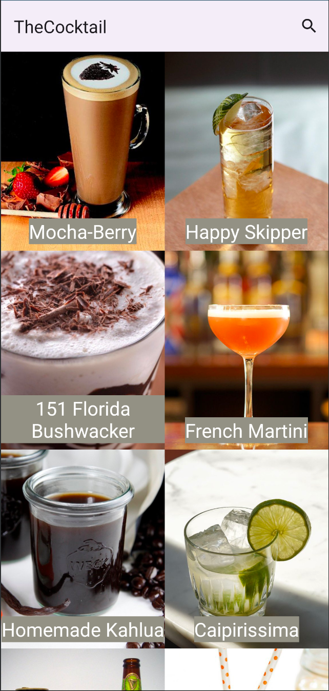
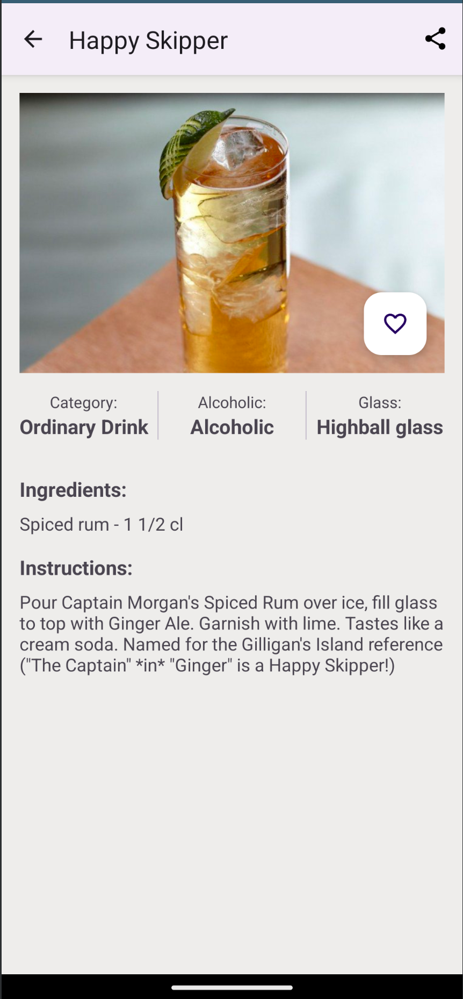
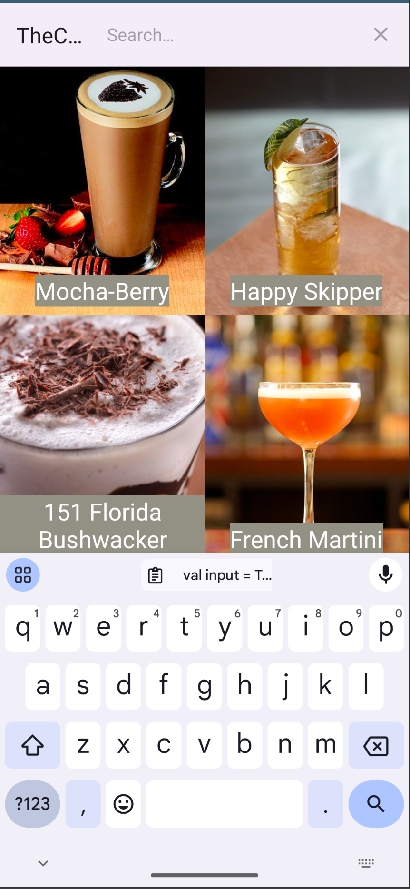
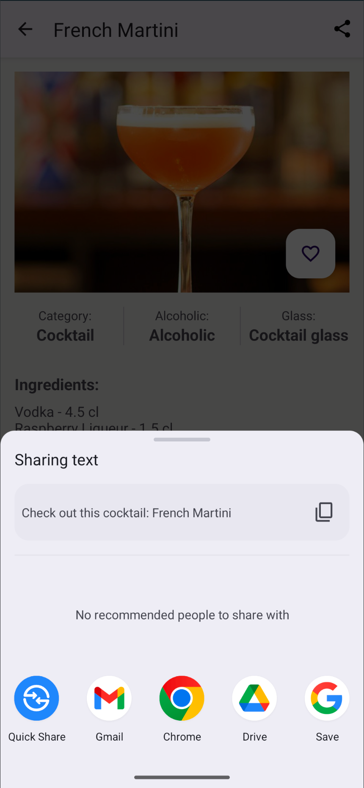
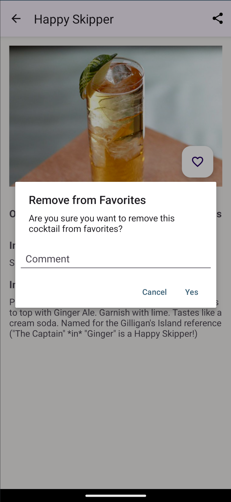

# The Cocktail

The Cocktail es una aplicación basada en una API que contiene diversa información sobre diferentes tipos de cócteles. La aplicación permite a los usuarios explorar, buscar y gestionar sus cócteles favoritos de una manera fácil e intuitiva.

## Características

- **Activity de Carga**: La primera activity informa al usuario que los datos se están descargando y que estarán disponibles en breve.
- **Lista de Cócteles**: La segunda activity muestra una lista de 10 cócteles aleatorios mediante un RecyclerView. Esta lista se recarga cada vez que se vuelve a esta activity.
- **Detalle del Cóctel**: La tercera activity proporciona detalles completos del cóctel seleccionado, pasando un parámetro desde la segunda activity.
- **Búsqueda y Compartir**: La aplicación incluye un AppBar con un menú de búsqueda para encontrar cócteles por su nombre y una opción para compartir la información del cóctel a través de SharedPreferences.
- **Favoritos**: En la pantalla de detalle, los usuarios pueden agregar un cóctel a sus favoritos utilizando un botón con un corazón. Al añadir a favoritos, el corazón se rellena; al desmarcar, se muestra un AlertDialog preguntando si se desea eliminar de favoritos y permite añadir un comentario explicando la razón.
- **ViewBinding**: Toda la aplicación utiliza ViewBinding para la comunicación entre las activities y los layouts.
- **Internacionalización**: La aplicación está preparada para la internacionalización, permitiendo futuras actualizaciones en más idiomas.

## Pantallazos

### Lista de Cócteles


### Detalle del Cóctel


### Búsqueda  


### Compartir


### Favoritos


## Instalación

1. Clona el repositorio:
    ```sh
    git clone https://github.com/tuusuario/TheCocktail.git
    ```

2. Abre el proyecto en Android Studio.

3. Sincroniza las dependencias de Gradle.

## Uso

1. Ejecuta la aplicación en un emulador o dispositivo Android.

2. Navega a través de las diferentes activities:
    - **Pantalla de Carga**: Espera a que los datos se descarguen.
    - **Lista de Cócteles**: Explora la lista de cócteles aleatorios.
    - **Detalle del Cóctel**: Consulta los detalles del cóctel seleccionado.
    - **Búsqueda y Compartir**: Utiliza el AppBar para buscar y compartir cócteles.
    - **Favoritos**: Agrega o elimina cócteles de tus favoritos y añade comentarios si eliminas alguno.

## Tecnologías Utilizadas

- **Kotlin**: Lenguaje de programación principal.
- **Android Jetpack**: Conjunto de bibliotecas para un desarrollo robusto y fácil.
- **Picasso**: Biblioteca para la carga y manipulación de imágenes.
- **Material Design**: Para una interfaz de usuario moderna y consistente.
- **ViewBinding**: Para la comunicación entre activities y layouts.

## Contribuciones

Las contribuciones son bienvenidas. Por favor, sigue estos pasos para contribuir:

1. Haz un fork del proyecto.
2. Crea una nueva rama (`git checkout -b feature/nueva-caracteristica`).
3. Realiza los cambios necesarios y commítelos (`git commit -m 'Añadir nueva característica'`).
4. Empuja los cambios a la rama (`git push origin feature/nueva-caracteristica`).
5. Crea un pull request.

## Licencia

Este proyecto está bajo la Licencia MIT - ver el archivo [LICENSE](LICENSE) para más detalles.

## Contacto

Para cualquier consulta, por favor contacta a [tuemail@ejemplo.com](gemavnz@gmail.com).
